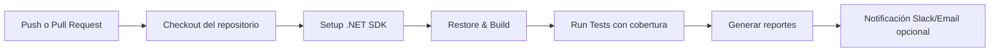

# MauiClimaDemo

Pipeline de **pruebas automáticas con GitHub Actions**.

Este proyecto implementa un flujo de integración continua (CI) que incluye:

1. **Clonación del repositorio**
2. **Ejecución de pruebas automatizadas** (unitarias)
3. **Generación de reportes de resultados y cobertura**
4. **Notificaciones** (opcional por Slack o email)

---

## 🛠️ Diseño del pipeline

