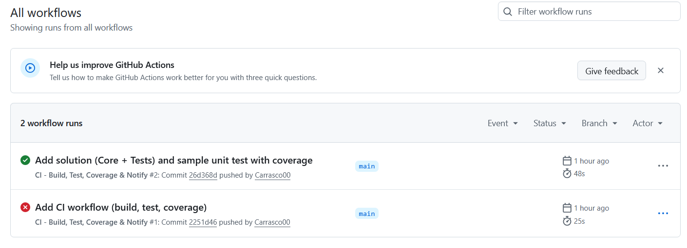

# MauiClimaDemo

Pipeline de **pruebas automáticas con GitHub Actions**.

Este proyecto implementa un flujo de integración continua (CI) que incluye:

1. **Clonación del repositorio**  
2. **Ejecución de pruebas automatizadas** (unitarias)  
3. **Generación de reportes de resultados y cobertura**  
4. **Notificaciones** (opcional por Slack o email)

---

## 🛠️ Diseño del pipeline

```mermaid
flowchart LR
    A[Push o Pull Request] --> B[Checkout del repositorio]
    B --> C[Setup .NET SDK]
    C --> D[Restore & Build]
    D --> E[Run Tests con cobertura]
    E --> F[Generar reportes]
    F --> G[Notificación Slack/Email opcional]

cat > README.md <<'EOF'
# MauiClimaDemo

Pipeline de **pruebas automáticas con GitHub Actions**.

Este proyecto implementa un flujo de integración continua (CI) que incluye:

1. **Clonación del repositorio**  
2. **Ejecución de pruebas automatizadas** (unitarias)  
3. **Generación de reportes de resultados y cobertura**  
4. **Notificaciones** (opcional por Slack o email)

---

## 🛠️ Diseño del pipeline

```mermaid
flowchart LR
    A[Push o Pull Request] --> B[Checkout del repositorio]
    B --> C[Setup .NET SDK]
    C --> D[Restore & Build]
    D --> E[Run Tests con cobertura]
    E --> F[Generar reportes]
    F --> G[Notificación Slack/Email opcional]

cat > README.md <<'EOF'
# MauiClimaDemo

Pipeline de **pruebas automáticas con GitHub Actions**.

Este proyecto implementa un flujo de integración continua (CI) que incluye:

1. **Clonación del repositorio**  
2. **Ejecución de pruebas automatizadas** (unitarias)  
3. **Generación de reportes de resultados y cobertura**  
4. **Notificaciones** (opcional por Slack o email)

---

## 🛠️ Diseño del pipeline

```mermaid
flowchart LR
    A[Push o Pull Request] --> B[Checkout del repositorio]
    B --> C[Setup .NET SDK]
    C --> D[Restore & Build]
    D --> E[Run Tests con cobertura]
    E --> F[Generar reportes]
    F --> G[Notificación Slack/Email opcional]


## 📊 Evidencias del pipeline

### ✅ Ejecución exitosa del workflow


### �� Resultados de pruebas


### 📈 Reporte de cobertura


